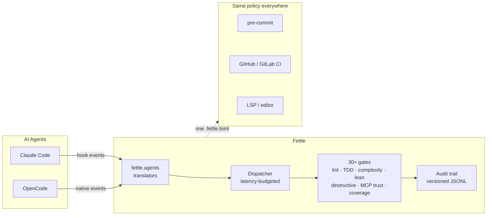

# Fettle

[](https://pypi.org/project/finefettle/)
[](https://github.com/MilindGaharwar/fettle/actions/workflows/ci.yml)
[](https://pypi.org/project/finefettle/)
[](LICENSE)

> **fettle** *(v.)* — foundry term: to trim and clean a rough casting fresh
> from the mold. *"In fine fettle"* — in excellent condition.

**The quality harness for AI-generated code — enforcement at the moment of
creation, not days later in code review.**

AI agents write code at machine speed; your review process still runs at
human speed. Every linter, CI gate, and review bot you already have fires
*after* the agent session that produced the bug has ended — the context is
gone, and the same antipattern gets written again tomorrow. Fettle hooks the
agent's own tool calls (Claude Code, OpenCode) and runs static analysis,
process gates, and **incident-derived LLM-antipattern rules** on every edit,
*inside the session*, where the agent can still fix it with full context.

```text
  agent writes code ─▶ Fettle gate fires ─▶ finding lands in-session ─▶ agent fixes it
       (ms)              (≤400ms budget)        (same context)           (immediately)
```

## 60-Second Start

```bash
git clone https://github.com/MilindGaharwar/fettle ~/projects/fettle
cd ~/projects/fettle && python3 fettle/cli.py init --install-tools
fettle doctor        # verify — hooks are live in your next agent session
```

CLI-only (hooks need the checkout): `pipx install finefettle`

**Status: v1.2.0 “Independence”** — real package namespace, agent
abstraction with per-agent conformance contracts, one-command setup,
validated config schema, CI parity across GitHub/GitLab/pre-commit — on top
of v1.0's enterprise integration (SonarQube/Black Duck/Pact adapters,
security review, threat modeling, deployment safety, mutation testing,
requirements traceability). Roadmap: [enterprise product plan](docs/fettle-enterprise-product-plan.md).

## What It Does



| Layer | Hook | What runs |
|-------|------|-----------|
| **Per-edit lint** | PostToolUse (Write/Edit) | ruff + semgrep on every Python edit |
| **TDD ordering** | PreToolUse + PostToolUse | Test-before-implementation enforcement (v0.9) |
| **Complexity** | PostToolUse (Write/Edit) | Cyclomatic + cognitive per modified function (v0.9) |
| **Lean review** | PostToolUse (Write/Edit) | Over-engineering detection: abstractions, wrappers, large additions (v0.8) |
| **Pre-write gate** | PreToolUse (Write/Edit) | Plan gate, config protection, UX spec gate |
| **MCP trust** | PreToolUse (Bash) | Package install allowlist |
| **Artifact integrity** | PreToolUse (Bash) | Destructive command guard |
| **Doc freshness** | PostToolUse (Bash) | Warns if implementation changed but no docs updated |
| **Bash audit** | PostToolUse (Bash) | Structured event logging, privacy-first (v0.8) |
| **Cross-file** | Stop | Import/contract resolution before response delivery |
| **Coverage gate** | Stop | Diff line + branch coverage from coverage.json (v0.8/v0.9) |
| **Discipline link** | PostToolUse | Injects skill reminders when loop/scope/lean gates fire (v0.8) |

## Why Fettle

Fettle occupies a gap none of the adjacent tool categories cover: **enforcement
at the moment AI generates code**, not minutes or days later.

| Category | When it acts | What it misses |
|----------|--------------|----------------|
| Linters & SAST (ruff, semgrep, SonarLint) | On demand / in editor | Not wired into agent sessions; no process enforcement; you configure and run them yourself |
| Commit hooks (pre-commit, Husky) | At commit time | Bad code already sits in the working tree; agents iterate dozens of edits per commit |
| CI quality gates (SonarQube, CodeQL) | At push/PR time | Feedback arrives after the agent session ended — the context that produced the bug is gone |
| AI code-review bots | At PR time | Review comments, not enforcement; nothing stops the pattern from being written again |

Fettle hooks the agent's own tool calls (PreToolUse/PostToolUse/Stop), so the
finding lands **inside the session that caused it**, where the agent can still
fix it with full context.

The governance model is **Human in Control, not Human in the Loop**: you set
policy once (`.fettle.toml`, advisory → enforce per gate) and retain full
authority over outcomes without approving every step. Gates are automatable,
agent-assessable checks — never manual approval meetings. Fail-open design
and strict latency budgets mean enforcement never becomes the bottleneck.
(The AI-Native Large-Scale Agile Manifesto, arXiv:2605.07717, names exactly
this model — Fettle is the assurance layer for it.)

### What's genuinely different

- **Incident-derived rules.** `/fettle:learn` turns a real production incident
  into a semgrep rule with test fixtures and an incident citation. The rules
  catalog isn't a generic style guide — every LLM-antipattern rule traces to
  something that actually broke.
- **Noise is a measured budget, not a hope.** `fettle bench` tracks
  findings-per-KLOC against committed budgets; rules are promoted
  advisory → enforce (and demoted back) based on evidence via `fettle ratchet`.
  A quality tool that doesn't measure its own false-positive rate becomes
  ignored wallpaper.
- **Process gates, not just pattern matching.** TDD ordering, plan-before-edit,
  diff coverage, complexity ceilings, over-engineering (lean) review,
  destructive-command guard, and an MCP package supply-chain gate — the
  engineering discipline around the code, not only the code.
- **One policy, every chokepoint.** The same `.fettle.toml` drives agent hooks,
  the CLI, pre-commit, CI (GitHub Action + SARIF), and the LSP server. No
  drift between what the editor warns about and what CI blocks.
- **Fail-open by design.** Hooks run under strict latency budgets and never
  crash or hang an agent session over an environment problem — enforcement
  degrades visibly (doctor, trace log) instead of breaking your flow.
- **Suppressions with expiry and owner.** Every suppression carries a reason,
  an owner, and an expiry date — expired suppressions resurface as findings
  instead of rotting silently.
- **It polices its own development.** Fettle's commit-time guards blocked two
  of Fettle's own commits during recent development (an intentional-fixture
  scan hit and a broad-except in new code). The harness that doesn't pass its
  own bar doesn't ship.

## Enterprise Operations (v1.3 arc, shipping now)

| Capability | How |
|---|---|
| **Central policy** | `[extends]` in `.fettle.toml` layers a digest-pinned org policy under repo config — content-addressed (sha256 verified on fetch *and* every cache read), cache-only in hooks (zero network in the hook path), offline-safe. `fettle policy sync\|status` |
| **Audit trail** | Every gate decision logged to versioned, append-only JSONL with repo attribution — prove what was enforced, when, where |
| **Org reporting** | `fettle report --org` rolls up decisions/violations/blocks per repo for platform teams |
| **CI dashboards** | SARIF (GitHub code scanning) + JUnit XML (`fettle check --junit` — GitLab, Jenkins, Azure DevOps) |
| **Config governance** | Published [JSON Schema](docs/fettle.schema.json), `fettle config --validate` with typo-catching unknown-key warnings — orgs review a schema, not source code |
| **Supply-chain stance** | Tokenless releases (PyPI Trusted Publishing/OIDC), pinned tool installs only on explicit user action — hooks never install anything |

## Intelligence Layer (v0.3.0+)

| Feature | Command | Description |
|---------|---------|-------------|
| **Learn** | `/fettle:learn` | Incident text → LLM-generated semgrep rule + fixtures + citation |
| **Explain** | `/fettle:explain` | Why did the last hook block? Human-readable trace |
| **Baseline** | `/fettle:baseline` | Snapshot violations for incremental adoption |
| **Report** | `/fettle:report` | Effectiveness metrics (pass/violation rates, top violations) |

## Rules Catalog (semgrep)

| Rule | Severity | Catches |
|------|----------|---------|
| `regex-llm-output` | ERROR | Regex-parsing LLM output instead of structured tool use |
| `bare-except-swallow` | ERROR | `except: pass` swallowing all errors |
| `broad-except-no-reraise` | ERROR | `except Exception` without re-raise or logging |
| `missing-httpx-timeout` | ERROR | httpx clients without timeouts |
| `sql-fstring` | ERROR | SQL built with f-strings (injection) |
| `health-score-inversion` | ERROR | Health checks returning perfect on no data |
| `orphaned-queue-flag` | ERROR | Queue writes with no verified consumer |
| `datetime-now-pipeline` | WARNING | `datetime.now()` in pipeline code (breaks backfill) |
| `non-atomic-write-output` | WARNING | Non-atomic writes in pipeline output paths |

Plus ruff: `BLE001`, `S110`, `S608`, `S701` as errors; `SIM*`, `UP*` as warnings.

## Installation

```bash
# Clone (agent hooks run from the checkout)
git clone https://github.com/MilindGaharwar/fettle ~/projects/fettle
cd ~/projects/fettle

# One command wires everything: repo config, Claude Code plugin symlink,
# OpenCode plugin registration, commit-time guards — idempotent.
python3 fettle/cli.py init --install-tools

# Verify
fettle doctor
```

`fettle init` detects which agents are installed and only wires those; add
`--dry-run` to preview. Hooks auto-activate via `hooks/hooks.json` once the
plugin symlink exists. OpenCode details: [docs/OPENCODE.md](docs/OPENCODE.md).

The CLI is also on PyPI — the `fettle` name belongs to an unrelated project,
so the package is **`finefettle`** (“in fine fettle”); the command is still
`fettle`:

```bash
pipx install finefettle
fettle doctor
```

(Agent hooks require the git checkout — wheels ship the CLI and rules only;
`fettle init` will tell you if a checkout is needed.)

## CLI

```bash
fettle init [--install-tools] [--dry-run]
fettle check [--all] [--changed] [--json] [--fix] [--baseline] [--junit FILE]
fettle config --print-effective
fettle config --explain
fettle config --validate
fettle policy sync|status
fettle report [--org] [--days N]
fettle explain [--last N]
fettle baseline create|update
fettle doctor
fettle lsp
```

`fettle check` flags:

| Flag | Effect |
|------|--------|
| `--changed` | Scan only git-changed Python files (staged, unstaged, untracked) |
| `--fix` | Apply safe ruff autofixes before scanning |
| `--baseline` | Report only findings not in `.fettle-baseline.json` |
| `--json` | Machine-readable output (same exit codes as text mode) |
| `--all` | Scan the whole tree (default; conflicts with `--changed`) |

Exit codes: `0` no error-severity findings · `1` error findings present ·
`2` usage or environment error. Identical for text and `--json` output —
safe to gate CI on.

## GitHub Actions

Use the composite Action at the same ref as your workflow:

```yaml
- uses: MilindGaharwar/fettle@main
  with:
    mode: advisory
```

For centralized adoption, call
`.github/workflows/fettle-reusable.yml`; both surfaces support SARIF and pull
request annotations. Pin a release tag instead of `main` for stable CI.

## Slash Commands (12)

| Command | Purpose |
|---------|---------|
| `/fettle:quality` | Full project scan |
| `/fettle:preflight` | Pre-deployment FMEA checklist |
| `/fettle:ops-review` | Operational readiness review |
| `/fettle:plan-activate` | Start a plan (required before edits in enforce mode) |
| `/fettle:plan-complete` | Mark plan done |
| `/fettle:mcp-approve` | Approve an MCP package |
| `/fettle:mcp-revoke` | Revoke MCP package trust |
| `/fettle:learn` | Generate rule from incident |
| `/fettle:explain` | Explain last hook decision |
| `/fettle:baseline` | Manage violation baselines |
| `/fettle:report` | Effectiveness metrics |

## Configuration

`.fettle.toml` at project root. Full reference: [docs/CONFIG.md](docs/CONFIG.md).

```toml
[gates.lint]
enabled = true
mode = "advisory"   # advisory | soft | enforce

[gates.lean_review]
mode = "advisory"   # silent | advisory — surfaces over-engineering findings (v0.8)

[gates.complexity]
enabled = true
max_cyclomatic = 10
max_cognitive = 15

[gates.coverage]
enabled = false
threshold = 80                  # Line coverage % for changed lines
minimum_branch_percent = 0      # Branch coverage (0 = disabled)

[gates.tdd]
enabled = false
mode = "advisory"               # advisory only in v0.9
accept_preexisting_tests = true

[gates.plan]
enabled = false
threshold = 3                   # Files changed before plan required
risk_paths = []                 # Globs that auto-require plan (e.g. "**/auth/**")
module_threshold = null         # Distinct packages, null = disabled
line_threshold = null           # Added lines, null = disabled

[gates.bash_audit]
enabled = false                 # Privacy-first: opt-in only
capture_command = false         # If true, applies redaction before logging

[gates.advisory]
cooldown_seconds = 300
max_per_turn = 3

[gates.discipline_link]
enabled = true
cooldown_seconds = 300

[severity]
error_rules = ["BLE001", "S110", "S608", "S701"]
warning_prefixes = ["SIM", "UP"]
```

## Architecture

```
Claude Code Tool Call
    │
    ▼
PreToolUse ──→ dispatcher.py selects checks by event + tool + extension:
             → quality_gate (plan, UX spec)
             → tdd_gate (test-first ordering)
             → config_protect, destructive_guard
             → mcp_trust_gate (Bash only)
    │
    ▼ (tool executes)
    │
PostToolUse ──→ dispatcher.py:
              → post_edit (ruff + semgrep on .py)
              → post_edit_ts, post_edit_go (language-specific)
              → complexity_check (cyclomatic + cognitive)
              → lean_sniffers (over-engineering detection)
              → bash_audit (structured event logging)
              → tdd_gate (records test/impl edits)
              → loop_detect + scope_creep + discipline_link
    │
    ▼
Stop ──→ dispatcher.py:
       → quality_gate (test freshness)
       → stop_quality_gate (imports + cargo check)
       → coverage_gate (line + branch coverage)
```

All checks route through `dispatcher.py` (single process, per-check budget,
advisory cap). 17 checks registered, ordered by priority, fail-open on error.

## Result Taxonomy

Every hook returns one of:

| Status | Meaning | User action |
|--------|---------|-------------|
| `PASS` | No issues | None |
| `VIOLATION` | Code quality issue | Fix the code |
| `TOOL_ERROR` | ruff/semgrep missing or crashed | Run `fettle doctor` |
| `CONFIG_ERROR` | Invalid .fettle.toml | Fix config |
| `SKIPPED` | File not in scope | None |

## Key Design Principles

1. **Advisory by default** — opinionated gates default off; lint is advisory; every block names its disable key
2. **Fail visible** — tool crashes surface as warnings, never as silent passes
3. **Rules carry receipts** — every rule has origin + citation; `/fettle:learn` rules cite their incident
4. **Single config source** — `.fettle.toml`, no scattered env vars
5. **No shared global state** — per-session state dirs

## Extensibility

### Check Registry (`fettle/dispatcher_registry.py`)

Every gate is a `CheckSpec` (name, events, matcher, budget, run function)
in one declarative table; the dispatcher selects and runs applicable checks
per hook event under per-check and per-event latency budgets.

### Agent Translators (`fettle/agents/`)

```python
from fettle.agents import detect_agent, normalize
hook_input = normalize(payload, fallback_cwd=os.getcwd())
# Claude Code hook JSON and native OpenCode plugin events both normalize
# to the same event model — conformance-tested per agent (WP-140).
```

### Language Adapters (`fettle/adapters/`)

Python, TypeScript, Rust, and Go adapters implement a common protocol
(`get_adapter(extension)`); external tools (SonarQube, Black Duck, Pact)
follow the `IntegrationAdapter` protocol with fail-open/fail-closed policy
per integration.

### Event Model (`fettle/event.py`)

```python
event = FettleEvent.from_stdin(HookType.POST_TOOL_USE)
# → typed, normalized: event.is_python, event.file_extension, event.repo_root
```

### Result Caching (`fettle/cache.py`)

Cache key = file content hash + config hash. Skips re-scanning unchanged files.

## Testing

```bash
cd ~/projects/fettle
.venv/bin/python -m pytest tests/ fettle/tests/ -q
```

**1150+ tests** across 120+ test files covering all checks, adapters, agent
translators, and infrastructure. All adapter tests use mocked tool outputs —
no eslint, biome, tsc, cargo, or semgrep installation required to run the suite.

## Roadmap

| Version | Theme | Status |
|---------|-------|--------|
| v0.2.0 | Core lint gates | **Shipped** |
| v0.3.0 | Process gates + intelligence foundation | **Shipped** |
| v0.4.0 | TS/JS rules, cross-review, SARIF, caching, autofix, checker protocol | **Shipped** |
| v0.5.0 | Adaptive enforcement platform | **Shipped** |
| v0.6.0 | Trust and precision | **Shipped** |
| v0.7.0 | Action, LSP, policy layering, OpenCode adapter | **Shipped** |
| v0.8.0 | Discipline integration (advisory contract, link pilot, budget, audit, coverage) | **Shipped** |
| v0.9.0 | Engineering discipline enforcement (branch coverage, complexity, plan thresholds, TDD) | **Shipped** |
| v1.0.0 | Enterprise integration (security review, threat model, deploy safety, adapters, SWEBOK gaps) | **Shipped** |
| v1.0.1 | Trustworthy core (audit fixes D1–D9, exit-code contract, `--version`) | **Shipped** |
| v1.0.2 | finefettle on PyPI, Trusted Publishing, commit-time guards | **Shipped** |
| v1.2.0 | Independence: package restructure, agent abstraction, `fettle init`, config schema | **Shipped** |
| v1.3.0 | Enterprise operations: central policy, audit/org reporting, JUnit, compliance evidence | **In progress** — WP-144/145 shipped |

See [docs/ROADMAP.md](docs/ROADMAP.md) for remaining governance and
distribution work.

## License

MIT (c) Milind Gaharwar
