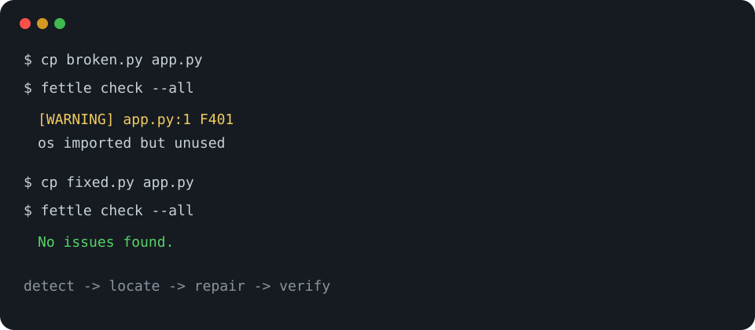

<p align="center">
  <picture>
    <source media="(prefers-color-scheme: dark)" srcset="https://raw.githubusercontent.com/MilindGaharwar/fettle/main/assets/wordmark-dark.svg">
    
  </picture>
</p>

<h3 align="center">Catch what your coding agent got wrong, in the session that made it</h3>

An agent makes thirty edits across nine files and reports that it's done. CI
disagrees forty minutes later, by which point the reasoning that produced the
code is gone and you're reconstructing intent from a diff.

Fettle runs your checks inside the agent session instead, so the finding lands
while the agent still knows why it wrote what it wrote — and can fix it itself.

<p align="center">
  <a href="https://pypi.org/project/finefettle/"></a>
  <a href="https://github.com/MilindGaharwar/fettle/actions/workflows/ci.yml"></a>
  <a href="https://pypi.org/project/finefettle/"></a>
  <a href="LICENSE"></a>
</p>

<p align="center">
  <a href="#start-in-two-minutes">Quick start</a> ·
  <a href="#the-problem-fettle-solves">Why Fettle</a> ·
  <a href="#what-makes-fettle-different">Why it is different</a> ·
  <a href="#capability-map">Capabilities</a> ·
  <a href="docs/README.md">Documentation</a>
</p>

```bash
pipx install "finefettle[all]"   # one installer — everything included
fettle demo
```

```text
[1/4] VIOLATION INTRODUCED  demo_project/calculator.py:4

   2 |     try:
   3 |         return int(value)
   4 |     except Exception:
   5 |         return None

   Broad handler hides unexpected failures.

[2/4] VIOLATION DETECTED
   broad-except-no-reraise  demo_project/calculator.py:4
   Rule: rules/llm-antipatterns.yml

[3/4] REPAIR APPLIED

   -     except Exception:
   +     except ValueError:

[4/4] REPAIR INDEPENDENTLY VERIFIED
   Re-ran check: clean
   Re-ran tests: 4 passed

   An unexpected TypeError now surfaces instead of being silently swallowed.
```

one package, no config, no API key, no network, no repository of your own.
Python 3.11+ and Git are the only prerequisites.

> **fettle** *(v.)* — a foundry term for trimming and cleaning a rough casting.

AI coding agents changed the unit of software work. A change is no longer just a
diff: it is a chain of prompts, tool calls, delegated workers, tests, exceptions,
and remote verdicts. Traditional quality tools inspect pieces of that chain.
Fettle governs the chain itself.

It gives agents useful feedback while code and intent are still in the same
conversation, carries policy into delegated work, and preserves independent
evidence for the moment trust actually matters.

```text
intent -> authority -> action -> evidence -> independent verification
                    Fettle assurance boundary
```

Fettle does not replace tests, review, CI, an orchestrator, or a sandbox. It
connects them into a fail-visible control loop, records decision provenance
without collecting hidden reasoning, and refuses to turn missing or malformed
evidence into a clean result.

## See The Loop

<p align="center">
  <a href="examples/assurance-loop/README.md">
    
  </a>
</p>

The checked-in [two-minute assurance loop](examples/assurance-loop/README.md)
contains the violating and repaired fixtures, complete transcript, reset path,
and an automated drift test. The visual is a summary; the executable example is
authoritative.

| Built for the agentic change loop | Current, reproducible scope |
|---|---|
| Agent hosts | Claude Code, Codex CLI, OpenCode; Gemini CLI contract-tested |
| Workspace routing | Python, JavaScript/TypeScript, Go, Rust |
| Independent evidence | Tests, remote CI, mutation reports, UAT, compliance and lineage reports |
| Delegation controls | Policy capsules, worktrees, claims, roles, topology, completion reports |
| Runtime footprint | Python 3.11+ and Git; base install has no third-party Python dependencies |

## Start in Two Minutes

Install once, prove the local loop, then initialize the repository you want to
govern:

```bash
pipx install "finefettle[all]"   # single installer: analyzers, mutation, evals, browser automation
# minimal core instead:  pipx install finefettle   (zero third-party Python deps)
# or with uv:            uv tool install "finefettle[all]"
fettle demo                  # deterministic, offline proof; changes no repo
cd your-project
fettle init --dry-run        # inspect files and host integrations first
fettle init --profile solo   # presets: solo | team | enterprise
fettle verify                # run tests and bind evidence to this change
fettle assurance             # inspect the resulting trust assessment
```

`fettle demo` starts with a broken Python fixture, shows the source and finding,
applies the repair, then proves all four fixture tests pass. `fettle assurance`
produces a digest-bound, nine-dimension record for a real repository:

```
Assurance Record c04c9a206c05 · PARTIAL · commit 25f4957
  ✓ behavior            PASS
  ✓ provenance          PASS
  ~ security            UNKNOWN — security evidence joins in P81
  ~ independence        UNKNOWN — no role declaration or spawn lineage
  ...
```

Every dimension is backed by evidence references or an honest explanation
of why it's unknown. Profiles: `solo` for individual repos, `team` adds
delegation gates, `enterprise` adds strict mode and compliance evidence.
Omit `--profile` for the guided interview.

The PyPI package is `finefettle`; the installed command is `fettle`. One
installer covers everything: `pipx install "finefettle[all]"` bundles the
Python analyzers, test and mutation runners, commit-hook support, evaluation
parsing, and the Playwright library alongside the governance core — rules,
guided workflows, and agent-host bridges ship inside the wheel itself. Plain
`pipx install finefettle` installs the dependency-free core for governance,
initialization, and the offline demo. Git is required. Browser engines, agent
CLIs, external services, and JavaScript/TypeScript, Go, and Rust toolchains
remain separate runtimes.

### Add Live Agent Governance

`fettle init` installs the supported host bridge and repository policy after
showing the planned changes. Run `fettle doctor` afterward to see which host and
external-runtime capabilities are available.

## The Problem Fettle Solves

Repository-bound quality controls are essential, but they often respond after
the generation loop has moved on. Fettle adds an earlier control point without
weakening the later ones.

| Control point | What it is good at | Fettle's role |
|---|---|---|
| Editor and linter | Immediate local feedback | Reuse analyzers from agent events |
| Commit hook | Protecting repository transitions | Catch selected issues before they accumulate |
| CI and review | Independent, reproducible evidence | Remain the fail-closed authority |
| Agent session | Intent and context are still available | Return findings and recovery steps in-session |

This matters most when an agent works across files, languages, or delegated
workers. Quality is not only a lint result; it is also whether policy survived
delegation, tests were independently run, evidence is fresh, and tool failure
was reported honestly.

## What Makes Fettle Different

Most developer tools answer one question: “is this file valid?” Fettle answers a
larger set: “was this agent authorized, did policy survive delegation, did the
right checks actually run, is the evidence still applicable, and what should the
developer do next?”

### One Policy Across Four Agent Hosts

Claude Code, Codex CLI, and OpenCode are live-verified; Gemini CLI is
contract-tested. Their events normalize into one dispatcher and one
`.fettle.toml` policy, so gate logic does not need to be rewritten for every
agent.

### Evidence Never Becomes Clean by Accident

Fettle distinguishes `pass`, `violation`, `tool_error`, `unknown`, and
surface-specific non-applicable outcomes. Missing analyzers, malformed output,
timeouts, and zero mutation evidence cannot manufacture a pass.

### Policy Survives Delegation

An agent launched through `fettle spawn` receives a digest-checked policy
capsule and lineage identity. Child policy may tighten but cannot loosen the
inherited boundary. Claims and worktrees coordinate ownership; role authority
can separate test authorship from implementation. These are application-level
controls, not operating-system isolation.

### Workspace-Aware Polyglot Routing

Nested Python, JavaScript/TypeScript, Go, and Rust workspaces are discovered
from native project markers. Edits route to the most specific workspace and its
repository-native tools. Python currently has the richest CLI and editor
surface; the [capability map](#capability-map) states the boundaries explicitly.

### Verification Is Bound to the Change

Verification writes a canonical local artifact alongside the legacy stamp. It
binds test results to the exact source snapshot, effective policy, selected
workspace/test scope, Fettle producer implementation, and execution occurrence.
The Stop gate recomputes those bindings and rejects missing, stale, malformed,
tampered, incomplete, or mismatched claimed artifacts with `fettle verify` as
the recovery command. Legacy-only stamps remain accepted during migration.
Remote CI remains an independent authority bound to the pushed commit; local
verification evidence does not substitute for it or become an attestation.

### Mutation Testing Produces Evidence, Not Theater

Python mutation preflight canonicalizes the engine corpus before expensive
execution. Full runs can resume by stable fingerprint, reject incompatible
checkpoints, and aggregate only complete ledgers. On pull requests, a required
`mutation evidence` check fans out bounded shards, automatically replays any
shard that timed out or lost its runner, and — as of v1.12 — **blocks merges
when changed-scope survivors go unaddressed**: missing, conflicting, or stale
evidence fails closed with the offending shard named. Two independent
calibrations established Fettle's own 28,723-mutant baseline with zero
untested outcomes.
Use the [mutation quality playbook](docs/mutation-quality-playbook.md) for setup,
the validation funnel, exit semantics, cache isolation, and recovery.

### Rules Learn From Real Failures, With Human Control

`fettle learn` drafts a rule from an incident or trace signature into
quarantine. A human reviews and promotes it; evidence and false-positive data
drive later ratcheting. The model may propose policy, but it cannot silently
activate it.

### Audited Against Its Own Threat Model

Fettle's evidence chain has been adversarially audited and hardened, and the
attacks are pinned by tests so they stay fixed: a hand-written verify stamp,
a deleted canonical-evidence reference, a forged assurance input, or a
crashed quality-gate subprocess can no longer produce a clean result. Live
agent runners execute with deny-by-default tool grants instead of blanket
permission bypasses — the same bypass flags Fettle's own spawn gate blocks.
`fettle doctor` states plainly which hosts can enforce a block and which can
only notify. A governance tool must hold the bar it sets; this one is built
to be attacked.

### Small Base, Complete Toolkit Extra

The base wheel has no third-party dependencies and supports governance,
initialization, and the offline demo. `pipx install "finefettle[all]"` is the
single installer that adds Python analyzers, test and mutation runners,
commit-hook support, evaluation parsing, and browser automation in one step.
Release CI tests both environments from the exact wheel.
Releases use PyPI Trusted Publishing, GitHub build provenance attestations,
pinned workflow actions, checksum-verified third-party tooling, and a
CycloneDX SBOM.

### Acceptance Is Tested From the User's Side

Living specifications connect requirements and Given/When/Then scenarios to
tests. Agentic UAT can exercise CLI, API, web, or library surfaces in an isolated
worktree and reports `CONFIRMED`, `CONTRADICTED`, `BLOCKED`, `UNOBSERVED`, or
`INDETERMINATE`; silence is never counted as success.

## Capability Map

Support is described by surface, not by one broad "polyglot" claim.

| Surface | Current scope |
|---|---|
| Agent lifecycle | Claude Code, Codex CLI, OpenCode live-verified; Gemini CLI contract-tested |
| Post-edit workspace adapters | Python, JavaScript/TypeScript, Go, Rust |
| `fettle check` | Python Ruff and bundled Semgrep rules |
| `fettle verify` | Affected discovered workspaces; Python can narrow to impacted tests |
| LSP / VS Code | Python diagnostics |
| External integrations | SonarQube, Black Duck/Polaris, Pact; opt-in |
| Guided workflows | 17 quality, security, planning, learning, and readiness workflows |
| Multi-agent controls | Worktrees, claims, topology, spawn, capsules, role authority, reports |
| Living specifications | Spec lint, scenario inventory, trace coverage, canonical drift evidence between specs, tests, and governed code |
| User acceptance | Agent-driven CLI, API, **web**, and library scenarios with artifact-bound verdicts; exploration charters propose candidate findings for human review |
| Mutation quality | Python preflight, changed/full runs, **enforced survivor gate**, replay machinery, canonical baseline comparison |
| Governance ledger | Tamper-evident hash-chained records anchored to commits (`fettle ledger`) |
| Graph intelligence | Advisory ephemeral hypergraph: `fettle graph status\|impact\|shadow` with digest-bound generations |
| Consistency contracts | Frozen cross-view divergence contracts: schema, lint, and template; execution remains planned |
| Assurance | Canonical result states, behavioral evals, compliance/lineage reports, TLA+ models for selected protocols |

### Quality and Security Gates

- Ruff and bundled Semgrep checks with actionable locations and rerun commands.
- Destructive-command, protected-config, MCP package-trust, secret, boundary,
  dependency, and deployment checks.
- Plan, TDD ordering, complexity, coverage, BDD, worklog, claims, verification,
  and remote-CI gates.
- Per-check budgets and advisory-first defaults so teams can measure signal
  before enabling enforcement.

### Mutation Evidence

```bash
fettle mutation preflight --all --json
fettle mutation run --changed --json
fettle mutation status --report mutation-report.json --json
fettle mutation baseline check report-a.json report-b.json \
  --run-id RUN_A --run-id RUN_B --floor 70 --json
```

Mutation testing is Python-only, requires pinned `mutmut==2.5.1`, and defaults
off. Full runs are scheduled/manual held-out verification; start with preflight
and changed-scope advisory evidence. See the
[mutation policy contract](docs/CONFIG.md#mutation-evidence-mutation).

### Evidence and Operations

```bash
fettle assurance               # canonical trust assessment for this change
fettle ledger status           # governance evidence ledger state
fettle ledger anchor           # bind terminal digest to current commit
fettle graph status            # ephemeral hypergraph digest + provider completeness
fettle graph impact src/       # advisory blast-radius closure
fettle graph shadow            # parity vs legacy semantic layer
fettle config --explain        # effective value and provenance for each key
fettle explain                 # recent gate decisions and recovery context
fettle verify                  # run tests and bind a verification stamp
fettle ci status               # remote CI verdict for the current commit
fettle report --days 7         # effectiveness and lineage evidence
fettle report --compliance     # CWE, OWASP ASVS, and SOC 2 control evidence
fettle ratchet status          # evidence for promotion or demotion
```

### Multi-Agent Work

```bash
fettle plan start --title "Add export" --item "Write contract test"
fettle topology advise
fettle spawn claude --role tester --task "Write the failing tests"
fettle work claim export-tests
fettle brief --json
```

Role-based authorship separation is available, while broader end-to-end
graduation evidence remains in progress. Start advisory and validate your agent
runner before enforcing it.

### Specifications and User Acceptance

```bash
fettle spec lint
fettle spec coverage
fettle uat doctor
fettle uat manual
```

Specifications remain plain Markdown in Git. UAT automation requires explicit
consent; manual walkthroughs remain available when an agent or browser cannot
run.

### Guided Workflows

```bash
fettle workflows list
fettle workflows install
```

The 17 bundled workflows cover quality review, PR review, security review,
threat modeling, deployment readiness, plans, worklogs, incident learning,
MCP approval, baselines, explanations, reports, and lean-debt tracking.

## Configuration

Start with advisory defaults and promote one gate at a time:

```toml
[gates.lint]
enabled = true
mode = "advisory"

[gates.tdd]
enabled = false
mode = "advisory"

[gates.verify]
enabled = false
mode = "advisory"
scope = "impacted"
```

Policy resolves through built-in defaults, org and team packs, digest-pinned
central policy, repository and directory configuration, environment overrides,
and a tighten-only delegation capsule. Inspect the final value and source with:

```bash
fettle config --validate
fettle config --explain
```

See the [configuration reference](docs/CONFIG.md) for the complete contract.

## Operational Boundaries

- Python 3.11 or newer is required.
- Git is required. Install it with `brew install git` on macOS,
  `sudo apt-get update && sudo apt-get install git` on Debian/Ubuntu, or
  `winget install --id Git.Git -e` on Windows.
- Agent transports can run from the v1.12.3 wheel or a source checkout. Installed
  bridges are versioned and digest-checked; rerun `fettle init` after upgrades.
- Browser engines require an explicit `playwright install`. Agent CLIs,
  shellcheck, and JavaScript/TypeScript, Go, and Rust toolchains remain external.
- Hooks favor session continuity and visible degradation; CI is the independent
  fail-closed boundary.
- Shell mediation, capsules, worktrees, and role gates are defense in depth,
  not a sandbox or substitute for least privilege.
- Formal models cover selected high-risk protocols, not the whole product.

## Documentation

| Goal | Guide |
|---|---|
| Choose an adoption path | [Documentation index](docs/README.md) |
| Configure gates and policy | [Configuration](docs/CONFIG.md) |
| Connect OpenCode | [OpenCode integration](docs/OPENCODE.md) |
| Use VS Code diagnostics | [VS Code integration](integrations/vscode/README.md) |
| Run behavioral evaluations | [Evaluation lab](evals/README.md) |
| Establish mutation evidence | [Mutation configuration](docs/CONFIG.md#mutation-evidence-mutation) |
| Understand evidence artifacts | [Evidence artifact contract](docs/evidence-artifact-contract.md) |
| Understand current and planned work | [Roadmap](docs/ROADMAP.md) |
| Review release history | [Changelog](CHANGELOG.md) |
| Contribute | [Contributing](CONTRIBUTING.md) |
| Report a vulnerability | [Security](SECURITY.md) |

## Contributing

Contributions are welcome. Fettle expects focused changes, explicit failure
states, clean and violating fixtures, and verification proportional to risk.
See [CONTRIBUTING.md](CONTRIBUTING.md) and the
[`good first issue`](https://github.com/MilindGaharwar/fettle/issues?q=is%3Aissue%20state%3Aopen%20label%3A%22good%20first%20issue%22)
backlog.

## License

Fettle v1.12.1 and later are licensed under the
[Apache License 2.0](LICENSE). Releases through v1.12.0 remain available under
the MIT License under which they were published. See the [trademark
policy](TRADEMARK.md) for permitted uses of the Fettle name and logos.
