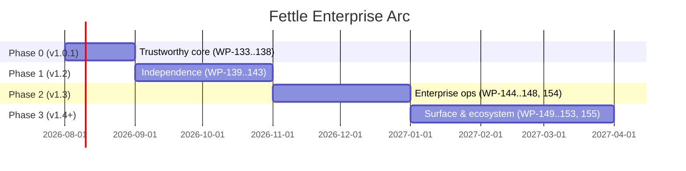

# Fettle — Enterprise-Grade Independent Product Plan

**Status:** Proposed (2026-07-24)
**Baseline:** v1.0.0 feature set, informed by the 2026-07-24 full-repo audit
**Goal:** Evolve Fettle from a Claude Code plugin with a CLI into a standalone,
enterprise-deployable quality-enforcement product that happens to have
excellent agent integrations.

---

## 1. Product Definition

**What Fettle becomes:** a policy-driven code quality enforcement engine with
three first-class delivery surfaces, none privileged over the others:

| Surface | Consumer | Today | Target |
|---|---|---|---|
| **Engine + CLI** | CI, pre-commit, terminals | Works, flags partially wired | Versioned, stable, contract-tested |
| **Agent hooks** | Claude Code, OpenCode, future agents | Primary surface | One adapter per agent over a shared core |
| **Server (LSP / API)** | Editors, dashboards, fleet mgmt | LSP prototype | Supported editor integration + org reporting |

**Enterprise-grade means:** deterministic behavior, secure by default,
observable, centrally configurable, auditable, installable through standard
channels, and supported by compatibility guarantees.

**Independent means:** zero hard dependency on `~/.claude/plugins` layout,
Claude Code payload shapes, or any single agent's hook lifecycle.

---

## 2. Current-State Assessment (from the audit)

Strengths to preserve:

- 1,038-test suite, clean semgrep packs, thoughtful wheel packaging
  (`setup.py` bundles `rules/` as `fettle/_rules/`), dispatcher budget design,
  fail-open session safety, adapter protocol from the v1.0 plan.

Defects that block "enterprise" claims (Phase 0 fixes all of them):

| # | Defect | Location |
|---|---|---|
| D1 | `fettle check --json` always exits 0 (CI gate silently passes) | `scripts/cli.py` |
| D2 | `check` flags `--fix/--changed/--all/--baseline` are no-ops | `scripts/cli.py` |
| D3 | MCP allowlist default path never loads (missing `expanduser`); literal `~` compare in protected-path check | `scripts/mcp_trust_gate.py` |
| D4 | LR012 sniffer 40 ms `git grep` timeout → nondeterministic feature + flaky test | `scripts/lean_sniffers.py` |
| D5 | Version incoherence: pyproject 0.7.0 vs README/CHANGELOG 1.0.0; no `fettle --version` | `pyproject.toml` |
| D6 | Hook launcher auto-installs unpinned tools from PyPI per invocation | `scripts/run.sh` |
| D7 | Destructive-guard allowlist substring match is bypassable | `scripts/destructive_guard.py` |
| D8 | `hooks.json` timeout unit ambiguity (10000 s ≈ 2.8 h) | `hooks/hooks.json` |
| D9 | 44 self-lint findings; fixtures not excluded; no ruff config for own repo | repo-wide |

Structural gaps for independence:

- Flat modules + `sys.path.insert` instead of a real package namespace.
- Three baseline implementations (`cli.py`, `baseline.py`, `quality_scan.py`).
- Config schema is conventions-in-code — no published schema or validation errors.
- No signed releases, no SBOM, no supply-chain attestation — for a tool that
  polices supply chains.
- Single-developer bus factor; no SUPPORT/SECURITY policy documents.

---

## 3. Phased Plan

Phasing rule: each phase is releasable on its own; later phases never depend
on unshipped earlier work. WP numbering continues after the reserved
v1.1 block (WP-127..WP-132).

### Phase 0 — Trustworthy Core (v1.0.1, hotfix arc)

*You cannot sell enforcement that doesn't enforce.*

- **WP-133 — CLI contract repair.** Fix D1 (exit codes identical for JSON and
  text modes: 0 clean, 1 errors, 2 usage/internal). Wire or remove D2's
  dead flags — `--changed` via `changeset.py`, `--fix` via `autofix.py`,
  `--baseline` via the consolidated baseline module (WP-136). Add
  `fettle --version` sourced from package metadata. Contract tests that pin
  exit codes and JSON schema.
- **WP-134 — Security gate repair.** Fix D3 (`expanduser` + absolute-path
  normalization for protected paths), D7 (anchored, per-segment allowlist
  matching), D8 (explicit, documented timeout units).
- **WP-135 — Determinism repair.** Fix D4 (raise LR012 timeout to 0.5 s,
  batch the per-function `git grep` calls into one), de-flake the suite,
  add a repeat-run flake job in CI.
- **WP-136 — Baseline consolidation.** One baseline module, one on-disk
  format (versioned), used by CLI, hooks, and CI identically.
- **WP-137 — Self-application.** Ruff config in `pyproject.toml` matching the
  README's advertised policy; exclude `tests/fixtures`; zero self-check
  findings enforced in CI (`fettle check` gating fettle's own repo).
- **WP-138 — Version & release hygiene.** Single version source; CHANGELOG,
  README, pyproject asserted equal by a release-gate test.

**Exit criteria:** 0 flaky tests over 20 consecutive CI runs; `fettle check`
exit codes contract-tested; self-scan clean.

### Phase 1 — Independence (v1.2)

*Decouple the engine from any one agent.*

- **WP-139 — Package restructure.** Real `fettle/` package (core, gates,
  adapters, surfaces), no `sys.path.insert`, public API defined in
  `fettle/__init__.py` with `__all__`. Keep `scripts/*.py` as thin shims for
  one release (deprecation window for existing symlink installs).
  *Status 2026-07-24: namespace, absolute imports, public API, and `scripts`
  compat symlink shipped; internal subpackage reorg (core/gates/surfaces)
  deferred to a later pass.*
- **WP-140 — Agent abstraction layer.** `AgentEvent` normalized model
  (edit / bash / stop / session-start) with per-agent translators:
  `claude_code.py`, `opencode.py`. Hook payload parsing lives only in
  translators; the dispatcher consumes `AgentEvent` exclusively. Conformance
  fixture suite per agent so payload drift is caught by tests, not users.
  *Status 2026-07-24: shipped as `fettle.agents` — detection, translators,
  conformance fixtures, and dispatcher integration; normalized model is the
  existing `HookInput`.*
- **WP-141 — First-class distribution.** Publish to PyPI as **`finefettle`**
  (name verified available 2026-07-24; the `fettle` name is taken by an
  unrelated project — console script remains `fettle`); `uv tool install` /
  `pipx` / Homebrew tap; `fettle init` bootstraps hooks for the detected
  agent(s), replacing the symlink ritual. Remove run.sh auto-install (D6):
  doctor reports missing tools, `fettle init --install-tools` installs them
  **pinned** and once.
  *Status 2026-07-24: finefettle 1.0.2 on PyPI via Trusted Publishing;
  `fettle init` shipped (agents, guards, pinned tools, doctor check);
  Homebrew tap outstanding.*
- **WP-142 — Config schema v1.** Published JSON Schema for `.fettle.toml`;
  `fettle config --validate` with precise errors; unknown-key warnings;
  schema version field with a migration path. This is the enterprise
  rollout artifact — orgs review a schema, not source code.
- **WP-143 — Pre-commit & CI parity.** Official `pre-commit` hook repo,
  reusable GitHub Actions workflow, GitLab CI template. One policy file,
  identical findings at editor, commit, and CI chokepoints (extends WP-122+).

**Exit criteria:** clean-machine install via `pipx install` + `fettle init`
on macOS/Linux completes in under 2 minutes with no manual symlinks; same
findings from hook, CLI, and CI on a reference repo.

### Phase 2 — Enterprise Operations (v1.3)

*What a platform team needs before mandating a tool.*

- **WP-144 — Central policy distribution.** `[extends]` in `.fettle.toml`
  pointing to an org policy (git URL or OCI artifact), cryptographically
  pinned (commit SHA / digest), cached with TTL, layered under repo config
  via the existing `policy_layers.py` precedence. Offline-safe: stale cache
  warns, never blocks.
- **WP-145 — Audit & reporting.** Append-only JSONL audit log of every gate
  decision (already partially in `trace.py`) with a stable schema; `fettle
  report --org` aggregates across repos; SARIF everywhere (already present)
  plus JUnit XML output for enterprise CI dashboards.
- **WP-146 — Compliance mapping.** Rules carry `metadata.compliance` tags
  (CWE already partially present; add OWASP ASVS, SOC 2 CC-series mapping);
  `fettle report --compliance` emits an evidence table. Aligns with the
  planned v1.1 governance arc (WP-127..132) — merge, don't duplicate.
- **WP-147 — Supply-chain posture.** Signed releases (Sigstore), SBOM
  (CycloneDX) published per release, SLSA provenance from GitHub Actions,
  pinned tool versions in doctor with `--verify-hashes`. The supply-chain
  gate vendor must pass its own bar.
- **WP-148 — Telemetry (opt-in, privacy-first).** Extend
  `health_telemetry.py`: anonymous counters only (gate fired / blocked /
  overridden), documented payload, org-level opt-in via central policy,
  default **off**. No code, paths, or identifiers ever leave the machine.
- **WP-154 — Verification-first (BDD) gate.** Strengthen `tdd_gate` from
  *test-before-implementation* to *spec-derived tests as a contract before
  code*: opt-in `[gates.bdd]` requiring Given–When–Then scenarios in the
  active spec, linked to tests via the existing `trace_requirements`
  machinery (WP-X5). Grounded in the AI-Native Manifesto's
  "New Assurance" principle (Britto et al., arXiv:2605.07717): requirements
  locked upfront, tests validate the spec — not just the implementation —
  and agents manage scenario overlap at scale.

**Exit criteria:** a platform team can roll out one policy to N repos, prove
what it enforced, and produce compliance evidence without touching any repo.

### Phase 3 — Product Surface & Ecosystem (v1.4+)

- **WP-149 — LSP hardening.** Promote `lsp_server.py` from prototype to
  supported: VS Code extension (marketplace-published from
  `integrations/vscode/`), Neovim docs, diagnostics parity with CLI.
- **WP-150 — Rule marketplace mechanics.** `fettle rules add <source>`
  installing versioned, signed rule packs; `rules/learned/` promotion flow
  (`ratchet.py`) extended cross-repo per the v1.1 plan.
- **WP-151 — Windows support.** Currently implicit macOS/Linux (bash
  launcher). Replace `run.sh` with a Python entry point (enabled by WP-139),
  CI matrix adds `windows-latest`.
- **WP-152 — Enterprise docs & support scaffolding.** `SECURITY.md`
  (disclosure policy), `SUPPORT.md`, versioning & deprecation policy
  (SemVer with 1-minor deprecation window), architecture doc, admin guide.
  Docs site (mkdocs-material) replacing the README-carries-everything model.
- **WP-153 — Benchmark & noise SLOs.** Publish the WP-118 bench results per
  release: findings-per-KLOC budgets, p95 hook latency budgets
  (250/400/600 ms), false-positive rate from `fp_stamp.py` data. Enterprises
  buy measured noise floors, not rule counts.
- **WP-155 — Semantic impact gate.** Extend the cross-file Stop check
  (`import_graph.py`) with knowledge-graph-backed impact analysis
  (kgraph integration): on multi-file changes, traverse
  requirement → code → test → defect links and surface blast-radius
  warnings inside the agent session. Implements the "semantic layer"
  cross-domain impact analysis from the AI-Native Manifesto (§3.1) —
  fact-grounded gating rather than pattern matching alone.

---

## 3b. Research Grounding

The AI-Native Large-Scale Agile Manifesto (Britto, Palmgren, Saini, Ohlin —
Ericsson/BTH, arXiv:2605.07717) independently validates Fettle's core bets
and supplies shared vocabulary worth adopting:

| Manifesto principle | Fettle counterpart |
|---|---|
| "Gates must be automatable, agent-assessable quality checks, not approval meetings" (§2.1) | The product thesis — hook-time enforcement |
| **Human in Control**, not Human in the Loop (§2.2) | Advisory→enforce ratchet, fail-open budgets: authority without bottleneck |
| Living knowledge that the system using it maintains (§2.3) | Incident-derived rules with citations, evidence-based promotion, expiring suppressions |
| Verification-first / BDD at scale (§2.4) | `tdd_gate` today; WP-154 closes the gap |
| Orchestrated agent workforces (§2.5) | Subagent injection + v1.1 governance arc (per-agent audit) |
| Blueprints with local adaptation (§2.6) | WP-144 central policy + repo-level overrides |

---

## 4. Cross-Cutting Workstreams

| Workstream | Owner activity throughout all phases |
|---|---|
| **Quality bar** | Fettle gates its own repo in CI (WP-137) from Phase 0 onward; no release with self-findings |
| **Compatibility** | Contract tests for CLI exit codes, JSON/SARIF schemas, hook payloads; breaking changes only at major versions |
| **Security** | Threat model refresh per phase (reuse `/fettle:threat-model`); external audit before the first paid/enterprise customer |
| **Performance** | Bench suite in CI with regression budgets; hook latency is a release gate |
| **Docs** | Every WP ships user-facing docs in the same PR |

---

## 5. Sequencing & Effort

Rough effort (single senior engineer, following the v1.0 plan's calibration
that estimates double once tests/docs/fixtures are included):

| Phase | Estimate |
|---|---|
| Phase 0 | 25–35 h |
| Phase 1 | 60–90 h |
| Phase 2 | 70–100 h |
| Phase 3 | 80–120 h |

---

## 6. Success Metrics

| Metric | Target |
|---|---|
| Install-to-first-finding time (clean machine) | < 2 min |
| Flake rate in CI | 0 over trailing 20 runs |
| p95 hook latency | within event budgets (250/400/600 ms) |
| Self-scan findings | 0, enforced |
| False-positive rate (fp_stamp data) | < 5% of surfaced findings |
| Supported agents behind the abstraction | ≥ 2 with conformance suites |
| Release artifacts | signed + SBOM + provenance, every release |

---

## 7. Risks & Mitigations

| Risk | Mitigation |
|---|---|
| PyPI `fettle` name unavailable | **Decided 2026-07-24: ship as `finefettle`** with `fettle` console script; publish a placeholder release early to secure the name |
| Package restructure breaks symlink installs | One-release shim window (WP-139) + doctor migration warning |
| Agent hook APIs drift (Claude Code / OpenCode) | Translator conformance fixtures (WP-140); payload changes fail tests, not users |
| Scope creep vs. v1.1 governance plan | WP-146 explicitly merges with WP-127..132; single roadmap table owns sequencing |
| Solo-maintainer bus factor | Docs-first WPs, ADRs for every architectural decision, CI as the release authority |
| Central policy fetch becomes an attack vector | Digest-pinned policies, offline-safe cache, no remote code — config only (WP-144) |

---

## 8. Immediate Next Actions

1. Fix D1–D4 (WP-133/134/135 core defects) — small diffs, high trust payoff.
2. Align versions + add `--version` (D5) and cut **v1.0.1**.
3. Add ruff self-config + fixture excludes (D9); turn on self-gating CI.
4. Update [ROADMAP.md](ROADMAP.md) release table with v1.0.1 and v1.2–v1.4 rows
   referencing this plan.
5. Decide the PyPI naming question early — it gates all Phase 1 install docs.
